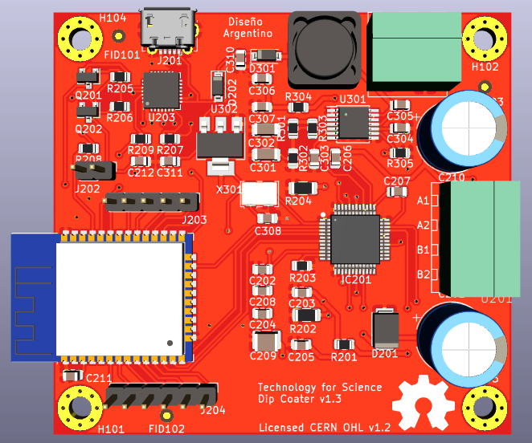

Repositorio de la materia Diseño de Circuitos Integrados de la Carrera de Especialización en Sistemas Embebidos UBA

El siguiente diseño incluye el circuito integrado TMC5130 de la empresa TRINAMIC para el manejo de motores paso a paso
conectado con el módulo del microcontrolador ESP32

Martin Abel Gambarotta
8vo Cohorte

View 3D

